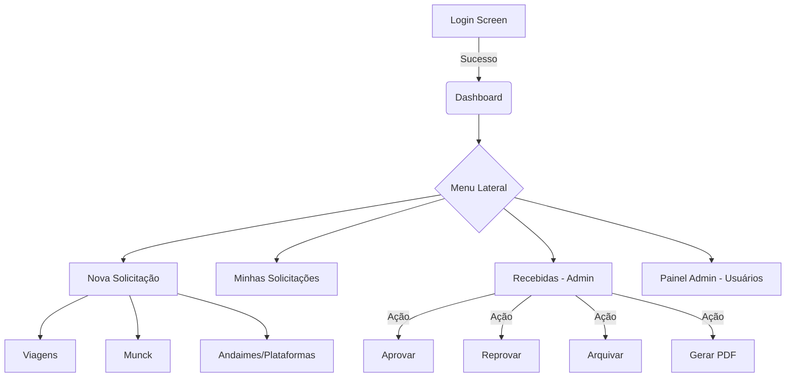

# Relatório de Inspeção DeepFile - vprequisições

**Data da Inspeção:** 2026-04-16
**Status do Sistema:** Operacional (Legado em PHP/React)
**Foco da Análise:** _vpsistema.com (Solicitações de Viagens, Munck e Andaimes)

---

## 1. Visão Geral do Sistema

O sistema **vprequisições** é uma plataforma corporativa da **VerticalParts** projetada para centralizar solicitações internas de logística e infraestrutura. 

### Objetivos Principais:
- **Gestão de Viagens:** Formalização de pedidos de transporte (aéreo/terrestre) e hospedagem.
- **Logística de Equipamentos (Munck):** Solicitação de caminhões Munck para movimentação de carga.
- **Infraestrutura (Andaimes e Plataformas):** Requisição de equipamentos para trabalho em altura.
- **Fluxo de Aprovação:** Sistema de status (Pendente, Aprovado, Reprovado, Arquivado) controlado por administradores.
- **Dashboard e Relatórios:** Visualização analítica via gráficos e extração de PDFs.

### Stack Tecnológica Identificada:
- **Frontend:** React (usando Babel Standalone para execução direta no navegador), Tailwind CSS para estilização, jsPDF para geração de documentos.
- **Backend:** PHP (API RESTful simplificada).
- **Banco de Dados:** MySQL (Hospedado na Hostinger).
- **Autenticação:** JWT (JSON Web Token) implementado manualmente no `helpers.php`.

---

## 2. Mapa de Layout e Navegação

O sistema utiliza um padrão de **Single Page Application (SPA)** simulado com React, com uma estrutura de navegação lateral (Sidebar).

### Estrutura Visual:
- **Sidebar (Esquerda):** 
  - Logo VerticalParts (Branco).
  - Itens de Menu: Dashboard, Solicitação de Viagem, Solicitação de Muncks, Andaimes e Plataformas, Minhas Solicitações.
  - Seções Admin (Visíveis apenas para 'admin'): Solicitações Recebidas, Painel Administrativo.
  - Botão de Logout (Sair).
- **Conteúdo Principal (Direita):**
  - Header dinâmico com título e subtítulo da seção ativa.
  - Container centralizado com bordas arredondadas e sombra (Shadow-lg).
- **Grid System:** Tailwind CSS (fraturas de grid como `sm:grid-cols-6` e `sm:col-span-3`).
- **Paleta de Cores:**
  - Primária: Amarelo (`bg-yellow-400`, `focus:ring-yellow-400`).
  - Tons de Cinza: Fundo (`bg-gray-50`), Sidebar (`bg-gray-800`), Texto (`text-gray-900`).



---

## 3. Inventário Detalhado de Campos (por contexto de negócio)

### A. Solicitação de Viagem (`Viagem`)
| Campo | Tipo | Requisito | Contexto |
| :--- | :--- | :--- | :--- |
| `departamento` | Texto | Obrigatório | Dados Empresa |
| `centroCusto` | Texto | Obrigatório | Dados Empresa |
| `cliente` | Texto | Obrigatório | Dados Empresa |
| `endereco` | Texto | Obrigatório | Localização |
| `objetivo` | Textarea | Obrigatório | Motivo |
| `nomeCompleto` | Texto | Obrigatório | Passageiro |
| `rg` / `cpf` | Texto | Obrigatório | Identificação |
| `email` | Email | Obrigatório | Contato |
| `origem` / `destino` | Texto | Obrigatório | Trajeto |
| `dataIda` / `dataVolta` | Data | Obrigatório | Período |
| `locacaoVeiculo` | Checkbox | Opcional | Logística |
| `necessitaHospedagem` | Checkbox | Opcional | Acomodação |
| `fotoDocumento` | Arquivo | Opcional | Anexo CNH/RG |

### B. Solicitação de Munck (`Munck`)
| Campo | Tipo | Requisito | Contexto |
| :--- | :--- | :--- | :--- |
| `encarregado` | Texto | Obrigatório | Responsável |
| `clienteProjeto` | Texto | Obrigatório | Escopo |
| `localServico` | Texto | Obrigatório | Endereço |
| `dataServico` | Data | Obrigatório | Execução |
| `horaServico` | Hora | Obrigatório | Execução |
| `pesoCarga` | Número | Obrigatório* | Técnica (Munck) |
| `alturaCarga` | Número | Obrigatório* | Técnica (Munck) |
| `ajudante` | Número | Obrigatório | Recursos Humanos |
| `fotosLocal` | Arquivo | Opcional | Anexo |

### C. Andaimes e Plataformas (`Andaime`)
| Campo | Tipo | Requisito | Contexto |
| :--- | :--- | :--- | :--- |
| `solicitante` | Texto | Obrigatório | Usuário |
| `projeto` | Texto | Obrigatório | Obra |
| `tipoEquipamento` | Select | Obrigatório | Técnico (Convencional, Elevatória, Tesoura) |
| `altura` / `largura` | Número | Obrigatório | Dimensões |
| `precisaART` | Select | Obrigatório | Segurança (Sim/Não) |
| `periodoDias` | Número | Obrigatório | Aluguel |

---

## 4. Regras de Validação e Lógica Identificada

- **Anexos:** Suporte para upload de arquivos via `FormData`. No frontend, as imagens (RG/Local) são convertidas via `FileReader` para `dataURL` e enviadas para a API.
- **Prazos (Munck):** Notificação explícita no código (`index.html:784`) de que solicitações de Munck exigem **antecedência de 7 dias**.
- **Segurança de Status:** Apenas usuários com `role: admin` podem alterar status de `Pendente` para `Aprovado`, `Reprovado` ou `Arquivado`.
- **Persistência de Admin:** Campos adicionais (Hotel, Transportadora, Meio de Pagamento) só podem ser editados pelo administrador após a submissão inicial.
- **Políticas de Viagem:** Alertas sobre contratação via Airbnb para > 2 diárias e locação de veículos na categoria "Compacto Com Ar".

---

## 5. Fluxo de Dados e Integrações

### Fluxo de Criação:
1. Usuário preenche formulário no React.
2. React chama `apiCreateRequest` enviando `FormData`.
3. PHP processa upload e move para `solicitacoes/api/uploads/`.
4. PHP insere registro na tabela `requests` com campos em formato JSON (coluna `details`).

### Endpoints Identificados (`api.php`):
- `?action=login`: POST `{username, password}` -> Retorna `{token, role}`.
- `?action=create_request`: POST `FormData` (type, details stringify JSON, main_file).
- `?action=update_status`: POST `{id, status}` (Auth Required: Admin).
- `?action=update_details`: POST `{id, details}` (Edição pós-submissão).

---

## 6. Oportunidades de Modularização para vprequisições v2

1.  **Shared UI Library:** Os componentes `InputField`, `SelectField` e `TextAreaField` no `index.html` estão declarados em um único arquivo de 1700+ linhas. Eles devem ser extraídos para componentes independentes (ex: `/components/ui/Input.tsx`).
2.  **Generic Form Handler:** Atualmente, cada formulário (`TravelRequestForm`, `MunckRequestForm`, `ScaffoldRequestForm`) tem sua própria lógica de `handleSubmit` e `handleChange`. Isso pode ser abstraído em um hook customizado (ex: `useRequisiçõesForm`).
3.  **Auth Context:** A gestão do `localStorage` e headers está espalhada. Migrar para um `AuthContext` do React ou `Zustand`.
4.  **Schema Type-Safety:** O uso de JSON dinâmico na coluna `details` do MySQL dificulta consultas complexas. Sugere-se migrar para tabelas tipadas ou usar o suporte JSON nativo com validação via **Zod** no backend/frontend.

---

## 7. Recomendações Técnicas para Migração

- **Migração para Next.js:** O sistema atual usa Babel Standalone, o que é ineficiente para produção. Uma estrutura Next.js permitiria Server Components e API Routes robustas.
- **Tipagem (TypeScript):** Definir interfaces para `ViagemDetails`, `MunckDetails` e `ScaffoldDetails` para evitar erros de campo nulo ou indefinido.
- **Validação:** Substituir a validação manual por **React Hook Form** + **Zod**.
- **Backend Node.js/Prisma:** Migrar o PHP para Node.js com Prisma permitiria maior escalabilidade e facilidade de manutenção no ecossistema VerticalParts existente.

---

## 8. Anexo: JSON cru dos campos extraídos

```json
{
  "contexts": {
    "viagens": [
      "departamento", "centroCusto", "cliente", "endereco", "complemento", "bairro", "cidade", "uf", "cep", "objetivo",
      "nomeCompleto", "rg", "cpf", "dataNascimento", "celularEmpresa", "email", "origem", "destino", "dataIda", "dataVolta",
      "observacoesViagem", "locacaoVeiculo", "tipoLocacao", "tipoVeiculo", "obsVeiculo", "necessitaHospedagem", "periodoHospedagem", "obsHospedagem"
    ],
    "munck": [
      "encarregado", "clienteProjeto", "localServico", "dataServico", "horaServico", "servicoTransporte", "especificacaoTransporte",
      "locacaoMunck", "pesoCarga", "alturaCarga", "comprimentoCarga", "tempoEstimado", "qtdMuncks", "tamanhoLanca", "tamanhoMunck",
      "outroTamanhoMunck", "descricaoServico", "paleteira", "paleteiraEletrica", "cintaElevacao", "ganchos", "ajudante", "outrosEquipamentos"
    ],
    "andaimes_plataformas": [
      "solicitante", "projeto", "tipoEquipamento", "altura", "largura", "dataInicio", "periodoDias", "localInstalacao", "observacoes", "precisaART"
    ],
    "admin_fields": [
      "hotel", "local", "meioPagamento", "transportadora"
    ]
  }
}
```
